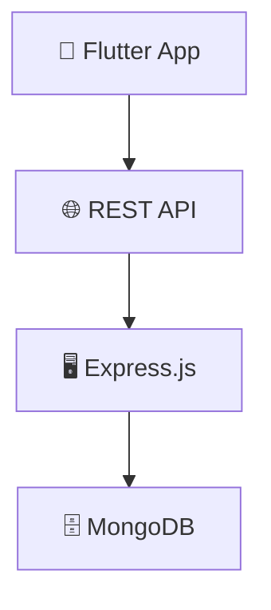

# 🚆 SNCFT Freight Management App

A modern Flutter mobile application with Node.js backend for railway freight management and optimization.

[](https://flutter.dev/)
[](https://nodejs.org/)
[](https://www.mongodb.com/)

**📅 Duration:** July - August 2024 | **🏢 Company:** SNCFT – Railway Freight Sector

---

## 📖 Overview

Digital solution for **SNCFT** (Société Nationale des Chemins de Fer Tunisiens) freight management, addressing key operational challenges through mobile technology and real-time tracking.

### Key Problems Solved
- ❌ Manual shipment tracking → ✅ Real-time digital tracking
- ❌ Poor communication → ✅ Integrated messaging system  
- ❌ High logistics costs → ✅ Route optimization
- ❌ Customer complaints → ✅ Streamlined complaint management

## 🎯 Features by User Role

<table>
<tr>
<td width="50%">

### 👤 **Clients**
- Order management & tracking
- Real-time shipment status
- Train schedule consultation
- Complaint system
- Transaction history

### 👨‍💼 **Administrators**
- User & role management
- Train & wagon oversight
- Order supervision
- Analytics dashboard
- System configuration

</td>
<td width="50%">

### 🚛 **Drivers**
- Route assignments
- Schedule management
- Mission notifications
- Mobile-optimized interface

### 👨‍💻 **Operators**  
- Operational monitoring
- Shipment coordination
- Customer support
- Activity tracking

</td>
</tr>
</table>

## 🛠️ Tech Stack

**Frontend:** Flutter (Dart) • MVC Architecture  
**Backend:** Node.js • Express.js • MongoDB • Mongoose • JWT  
**Testing:** Mocha • Chai  
**Tools:** Android Studio • VS Code • Postman

## ⚙️ Architecture



**MVC Pattern** with secure JWT authentication and real-time communication.

## 📂 Project Structure

```
sncft-freight-app/
├── 📱 frontend/          # Flutter app
│   ├── lib/
│   │   ├── models/      # Data models
│   │   ├── views/       # UI screens
│   │   ├── controllers/ # Business logic
│   │   └── services/    # API integration
│   └── test/
├── 🖥️ backend/          # Node.js API
│   ├── models/         # MongoDB schemas
│   ├── routes/         # API endpoints
│   ├── controllers/    # Logic handlers
│   └── tests/          # Unit tests
└── 📄 docs/            # Documentation
```

## 🚀 Quick Start

### Prerequisites
- Flutter SDK ≥3.0.0, Node.js ≥16.0.0, MongoDB ≥5.0.0

### Installation

```bash
# 1. Clone repository
git clone https://github.com/your-username/sncft-freight-app.git

# 2. Backend setup
cd sncft-freight-app/backend
npm install
cp .env.example .env  # Configure your environment
npm start

# 3. Frontend setup  
cd ../frontend
flutter pub get
flutter run
```

## 📱 Application Showcase

### 🔐 Authentication Flow
<div align="center">


</div>

### 📊 Dashboard Views
<div align="center">


</div>

### ⚙️ Core Features
<div align="center">


</div>

*More screenshots available in `/screenshots` directory*

## 🚀 Future Enhancements

- 🤖 AI-powered route optimization
- 🗺️ Real-time GPS tracking  
- 📊 Advanced analytics dashboard
- 🌐 Web application version
- 🌍 Multi-language support

---

## 📄 License & Contact

**Project Duration:** July-August 2024  
**Internship:** SNCFT Railway Freight Sector

*Developed to modernize railway transport in Tunisia* 🇹🇳

---

<div align="center">
<strong>Built with ❤️ for digital transformation in railway logistics</strong>
</div>