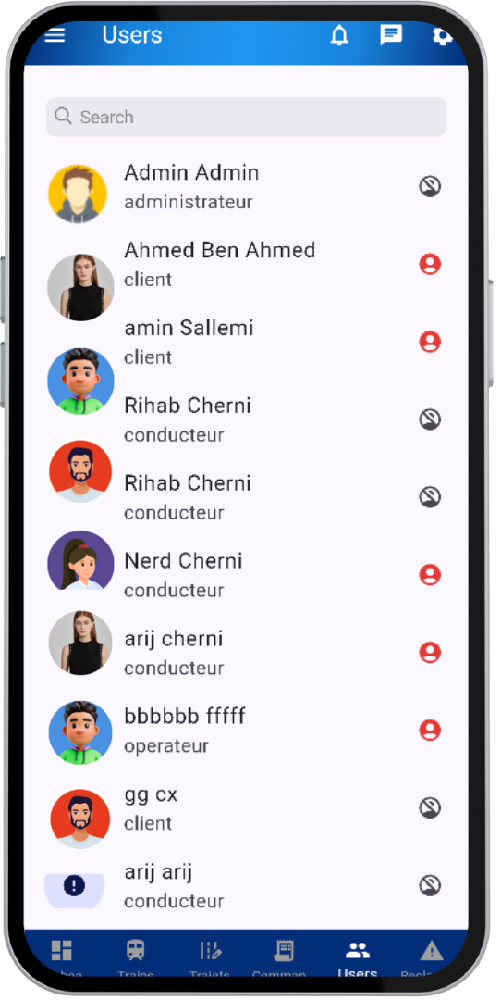

# 🚆 SNCFT Freight Management App
> **Digital transformation for Tunisian railway freight transport**  
> 📅 **Duration:** July 8 - August 8, 2024 | 🏢 **Company:** SNCFT Railway Freight Sector

   

## Overview
Flutter mobile app with Node.js/Express backend and MongoDB for **SNCFT railway freight management and optimization**.

### Problem & Solution

| **Current Challenges** | **Our Solution** |
|------------------------|------------------|
| ❌ Lack of shipment traceability | ✅ Real-time tracking system |
| ❌ Manual processes & delays | ✅ Automated workflow management |
| ❌ Poor resource optimization | ✅ Smart resource allocation |
| ❌ Limited mobile accessibility | ✅ Cross-platform mobile app |
| ❌ High operational costs | ✅ Cost optimization tools |

## Technology Stack
| **Category** | **Technologies** |
|--------------|------------------|
| **Frontend** | Flutter, Dart, MVC Architecture |
| **Backend** | Node.js, Express.js, JWT Authentication |
| **Database** | MongoDB, Mongoose ODM |
| **Testing** | Mocha, Chai |
| **Tools** | Android Studio, VS Code, Postman, MongoDB Compass |

## Key Features

### User Roles & Features
| **Role** | **Core Features** |
|----------|-------------------|
| **👤 Client** | Order management, shipment tracking, schedule consultation, complaints, reviews |
| **👨‍💼 Admin** | User/train/wagon management, order supervision, analytics dashboard |
| **🚛 Driver** | Route consultation, schedule management, mission notifications |
| **⚙️ Operator** | Operational monitoring, shipment management, customer support |

### Common Features
- 🔐 Secure authentication & registration
- 🔔 Real-time notifications
- 💬 Internal messaging system
- 📊 Transaction history
- ⚙️ Profile & settings management

## Quick Start
- Prerequisites  Flutter SDK ≥3.0.0, Node.js ≥16.0.0, MongoDB ≥5.0.0
- Setup
| **Backend** | **Frontend** |
|-------------|--------------|
| `git clone [repo-url]` | `cd frontend/` |
| `cd backend/ && npm install` | `flutter pub get` |
| `cp .env.example .env` | `flutter run` |
| `npm start` | |

## Application Interfaces

### Authentication & Welcome
| **Screen** | **Description** |
|------------|-----------------|
|  | **Loading Screen** - SNCFT welcome interface |
|  | **Welcome Screens** - Feature introduction for stakeholders |
|   | **Registration** - User signup with company details |
|   | **Authentication** - OTP recovery & secure login |

### Common Interfaces
| **Feature** | **Interface** | **Description** |
|-------------|---------------|-----------------|
| **Settings** |  | Theme toggle, language selection, contact info |
| **Profile** |  | Personal information & profile picture management |
| **Messaging** |  | Real-time communication between users |
| **Notifications** |  | Important updates & alerts system |

### Client Features
| **Function** | **Interface** | **Capabilities** |
|--------------|---------------|------------------|
| **Dashboard** |  | Activity overview, order statistics, delivery summaries |
| **Schedules** |  | Train schedule search by station & date |
| **Orders** |  | Order tracking, management, history, CRUD operations |
| **Support** |   | Complaint submission & service rating system |

### Admin Features
| **Management Area** | **Interface** | **Functions** |
|--------------------|---------------|---------------|
| **Dashboard** |  | Global overview of operations, orders, trains, incidents |
| **Users** |  | User account creation, modification, role assignment |
| **Trains** |  | Route supervision, schedule & capacity management |

### Public Access
| **Service** | **Interface** | **Access** |
|-------------|---------------|------------|
| **Train Schedules** |  | Public transport timetable consultation |
| **General Info** |  | SNCFT services, materials, transport conditions |

## SNCFT Mission & Values
| **Component** | **Description** |
|---------------|-----------------|
| **🎯 Mission** | Secure, punctual railway transport with infrastructure development |
| **💎 Values** | 🛡️ Security, ⚡ Efficiency, 💡 Innovation, 🌱 Sustainability |
| **📋 Services** | Passenger transport, freight transport, maintenance, infrastructure, tech innovation |

## Future Roadmap
| **Planned Features** |
|---------------------|
| 🤖 AI optimization, 🗺️ real-time geolocation |
| 📊 Advanced analytics, 🌐 web version |
| 🌍 Multi-language support, 📈 performance monitoring |
| 🔐 Enhanced security, additional integrations |